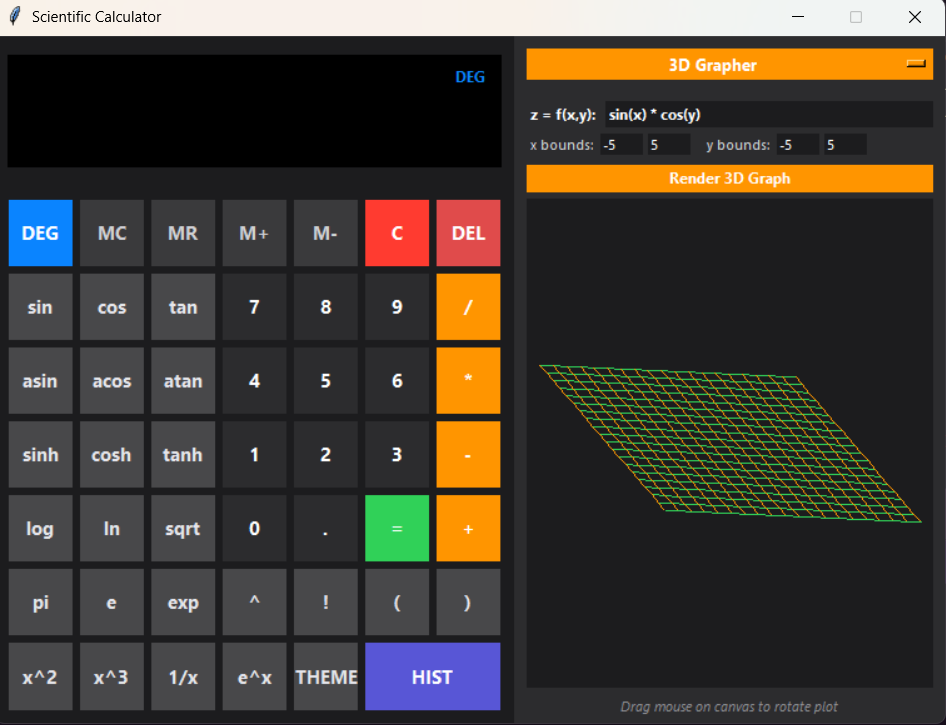
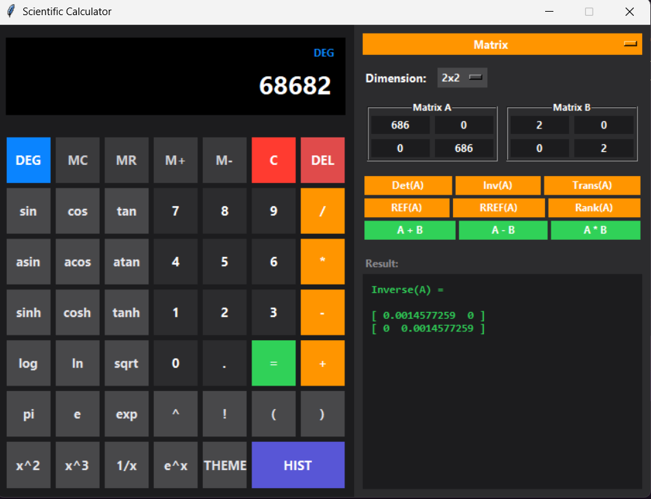
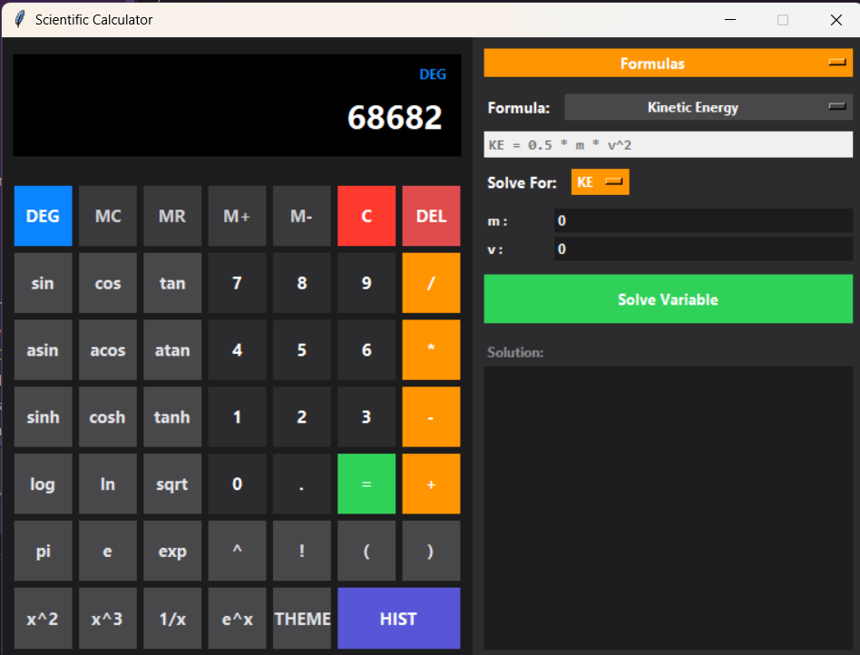
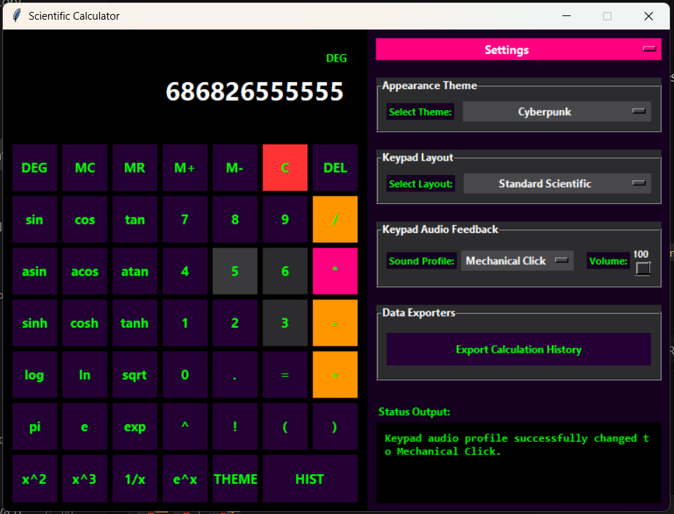
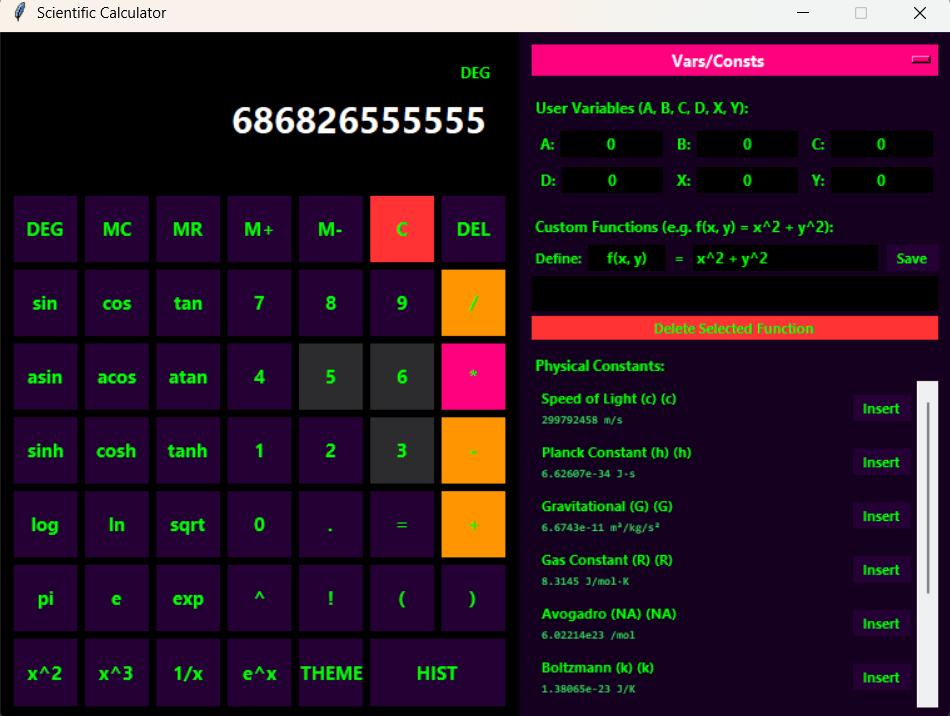

# Premium Desktop Scientific & Engineering Calculator

A professional, Casio-inspired desktop scientific calculator built with Python and Tkinter. This application features a stabilized AST-based mathematical expression evaluator, multi-mode 2D/3D graphing, computer algebra system (CAS) symbolic differentiation, statistics hypothesis testing, interactive physics simulations, and a standalone Windows executable.

---

## 📷 Screenshots & Interface

<p align="center">
  <strong>3D Surface Grapher</strong><br />
  
</p>

<p align="center">
  <strong>Matrix Operations & Solver</strong> &nbsp;&nbsp;&nbsp;&nbsp;&nbsp;&nbsp;&nbsp;&nbsp;&nbsp;&nbsp;&nbsp;&nbsp;&nbsp;&nbsp;&nbsp;&nbsp;&nbsp;&nbsp;&nbsp;&nbsp;&nbsp;&nbsp;&nbsp;&nbsp;&nbsp;&nbsp;&nbsp;&nbsp;&nbsp;&nbsp;&nbsp;&nbsp; <strong>Formula Library Solver</strong><br />
  
  &nbsp;&nbsp;&nbsp;&nbsp;
  
</p>

<p align="center">
  <strong>Settings & Audio Feedback (Cyberpunk)</strong> &nbsp;&nbsp;&nbsp;&nbsp;&nbsp;&nbsp;&nbsp;&nbsp;&nbsp;&nbsp;&nbsp;&nbsp;&nbsp;&nbsp;&nbsp;&nbsp;&nbsp;&nbsp;&nbsp;&nbsp;&nbsp;&nbsp;&nbsp;&nbsp; <strong>Variables, Constants & Custom Functions</strong><br />
  
  &nbsp;&nbsp;&nbsp;&nbsp;
  
</p>

---

## 🌟 Detailed Feature Breakdown

### 1. Mathematical Expression Parser
* **Secure AST Evaluator**: Features a custom Abstract Syntax Tree parser that prevents Python code injection and handles all calculations securely.
* **Logarithmic Safety Checks**: Intercepts calculations before execution to prevent memory exhaustion and crashes from excessively large exponents (e.g. `9^9^9` or division/underflow values).
* **Recursion Capping**: Automatically limits recursion depth of parenthesized expressions, mapping potential stack overflows to clean, descriptive error logs rather than crashing.
* **Implicit Multiplication**: Supports intuitive syntax like `3x`, `x(x+1)`, and `5 sin(pi)` by automatically inserting multiplication operators during parsing.

### 2. Complex Numbers & Phasor Tool
* **Complex Arithmetic**: Full parser support for imaginary units (`a + bi` notation) utilizing lowercase `i` (while keeping uppercase `I` open for physical formula variables).
* **Fractional Complex Roots**: Evaluates negative fractional exponents (e.g. `(-4)^0.5` yielding `2j` which formats to `2i`).
* **Phasor Vector Converter**: Converts rectangular complex numbers (real + imaginary) to polar representations ($r \angle \theta$) in either RAD or DEG modes. Renders the complex phasor vector on a concentric grid canvas.

### 3. Real-Time 2D & 3D Graphing
* **2D Multimodal Plotter**: Plots up to 3 equations concurrently in distinct colors (Orange, Blue, Green). Supports Cartesian ($y=f(x)$), Polar ($r=f(\theta)$), and Parametric ($x(t), y(t)$) modes.
* **Interactive Pan & Zoom**: Allows drag-to-pan on the canvas, mouse-scroll wheel zoom, and zoom buttons to navigate curves.
* **Hover coordinate tracking**: Traces coordinates under the mouse cursor using a vertical crosshair and floating tooltip labels.
* **Critical Points Scanner**: Scans curves using numerical bisection to highlight and label Roots ($f(x)=0$), Extrema (min/max points via derivative sign-changes), and Intersections of multiple functions.
* **3D Surface Grapher**: Plots 3D mathematical wireframe meshes $z=f(x,y)$. Features drag-to-rotate 3D viewing using orthographic projection matrices.
* **Image Exporter**: Exports high-resolution PNG copies of the 2D canvas plotter via file dialog.

### 4. Computer Algebra System (CAS) & Calculus
* **Symbolic CAS Engine**: AST-based symbolic differentiation engine that differentiates math expressions and automatically simplifies them using algebraic reduction rules (constant folding, multiplication scaling, algebraic subtraction merging).
* **Calculus Suite**: Renders numerical calculus definite integrals using Simpson's Rule ($N=1000$) and derivative calculations using central finite difference ($h=10^{-6}$).

### 5. Matrix & Vector Mathematics
* **Matrix Algebra Suite**: Renders input grids for 2x2 and 3x3 matrices. Supports expression-based cells and computes Determinant, Transpose, Inverse, REF, RREF, and Rank.
* **Vector Mathematics**: Renders magnitude, dot product, cross product, projections, and angles for 2D and 3D vectors.

### 6. Equation Solvers Suite
* **Root Finder**: Resolves single-variable equations $f(x)=0$ using the Newton-Raphson numerical method.
* **Linear Systems**: Solves 2x2 and 3x3 systems of equations using Cramer's Rule.
* **Polynomial Solvers**: Renders real and complex roots for quadratic and cubic equations.
* **Step-by-Step logs**: Renders intermediate algebraic steps (coefficients, discriminant, Cramer's determinants) in a detailed popup log window.

### 7. Formula Library Presets
* **Preset Formulas**: Library of equations including Ohm's Law, Ideal Gas Law, Kinetic Energy, and Einstein's mass-energy equivalence.
* **Dynamic Solver**: Automatically parses variables and solves for *any* chosen target variable using numerical root-finding.

### 8. Statistics & Hypothesis Testing
* **Descriptive Statistics**: Calculates count, mean, median, standard deviation, linear regression fittings ($y=mx+c$), combinations/permutations, and normal CDF.
* **Hypothesis Testing Tab**: Conducts 1-Sample Z-Test, 1-Sample T-Test, 2-Sample Welch T-Test, and Chi-Square Goodness-of-Fit tests with critical values and p-values approximations.

### 9. Interactive Physics & Math Simulations
* **Projectile Motion**: Input launch speed, angle, and gravity to animate trajectory flight paths with real-time speed, altitude, and range telemetry.
* **Fourier Wave Builder**: Select Square, Sawtooth, or Triangle shapes to watch harmonic sine components sum up and converge to the target wave profile in real time.

### 10. TVM Financial Solver
* **Time Value of Money**: Solves for $N, I/Y, PV, PMT, FV$ compounding types with detailed loan amortization breakdowns.

### 11. Settings, Exporters & Aesthetics
* **Keypad Audio Feedback**: Select Mechanical Click, Soft Pop, or Retro Beep click sound profiles with volume sliders. Sounds play asynchronously using native Windows sound APIs to maintain zero click latency.
* **Appearance Customization**: recursively repaint themes including Midnight, Casio Classic, Cyberpunk (Neon), and Arctic Frost. Supports keypad layout toggles between "Standard Scientific" (7x7) and "Basic Focus" (4x5) grids.
* **Persistent History**: Stores calculation history in `~/.calculator_history` so it persists across launches. Double-clicking any past entry loads it back into the active editing line. Includes options to export history to CSV or TXT format.

---

## 🚀 How to Run the App

### Standalone Desktop Executable (No Python Required)
You can launch the calculator directly as a normal desktop application without needing Python or open terminals:
1. Open the `dist/` directory in this project.
2. Double-click **`ScientificCalculator.exe`**.
3. You can also search for the app by pressing the **Windows Key** and typing **`Scientific Calculator`** (the Start Menu shortcut is automatically indexed).

### Running from Source
1. Make sure you have Python 3.8+ installed.
2. Clone this repository and run:
   ```bash
   python main.py
   ```

---

## 🧪 Running Unit Tests

The project comes with **126 unit tests** verifying the math parser stability, calculus, solver, and UI bindings:
```bash
python -m unittest discover -s tests
```
