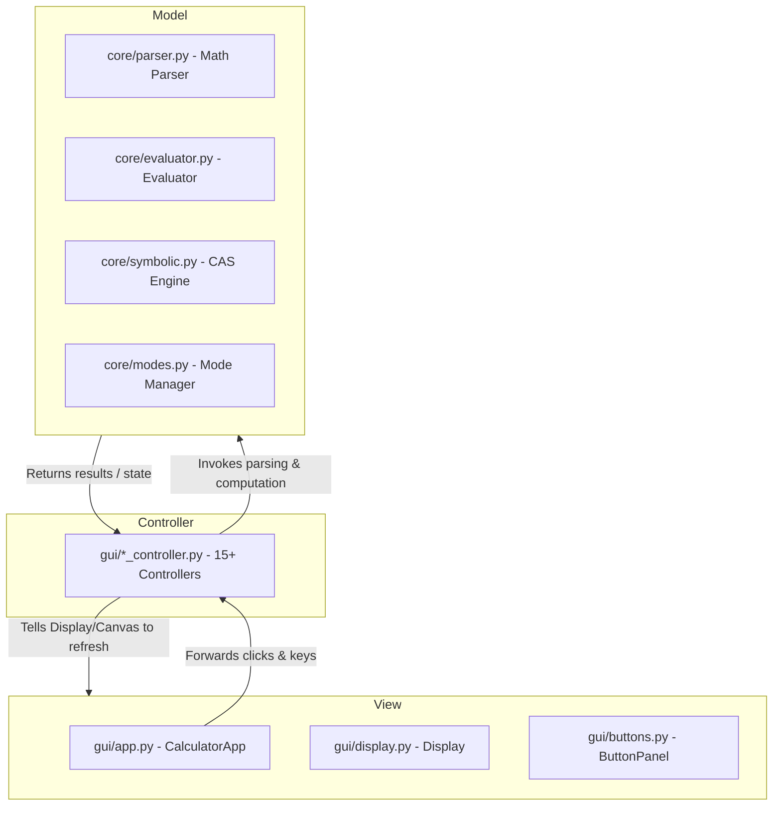

# 📓 Scientific Calculator Technical Wiki

Welcome to the Technical Wiki for the Desktop Scientific & Engineering Calculator project. This document serves as a complete reference for developers, details the software architecture, explains mathematical equations, documents numerical approximations, and details subsystem integrations.

---

## 🏛️ 1. Software Architecture (Decoupled MVC Pattern)

The application uses a strict **Model-View-Controller (MVC)** design pattern. This keeps visual layout, event binding, and mathematical computations fully decoupled.



### Module Descriptions

1. **Model Layer (`core/`)**:
   * [core/parser.py](file:///s:/Project/calculator/core/parser.py): Lexical normalizer. Cleans up raw calculator inputs, expands constants, resolves case sensitivity, and inserts implicit multiplication operators.
   * [core/evaluator.py](file:///s:/Project/calculator/core/evaluator.py): Evaluates expressions safely by converting strings into Abstract Syntax Trees (AST), validating limits, and executing nodes.
   * [core/symbolic.py](file:///s:/Project/calculator/core/symbolic.py): AST-based Computer Algebra System (CAS). Operates symbolic differentiation and expression reduction.
   * [core/modes.py](file:///s:/Project/calculator/core/modes.py): Keeps track of angle calculation states (Radians vs. Degrees).
   * [core/functions.py](file:///s:/Project/calculator/core/functions.py): Custom mathematical function registrations and safe equivalents.

2. **View Layer (`gui/`)**:
   * [gui/app.py](file:///s:/Project/calculator/gui/app.py): The application shell coordinator. Manages parent grid frames, registers sidebar drawers, binds key handlers, and runs the main event loop.
   * [gui/display.py](file:///s:/Project/calculator/gui/display.py): Implements custom drawing for cursor tracks, parentheses highlights, and visual mode indicator tags.
   * [gui/buttons.py](file:///s:/Project/calculator/gui/buttons.py): Keypad layouts (Scientific 7x7 grid or Basic 4x5 grid).

3. **Controller Layer (`gui/*_controller.py`)**:
   * Over 15 specific controllers route parameters, execute logic, draw visualizations on Tkinter canvases, and catch math errors.

---

## 🧮 2. Lexical Parsing & AST Evaluation

### Implicit Multiplication Parsing
To make expression input feel natural, [core/parser.py](file:///s:/Project/calculator/core/parser.py) adds explicit multiplication operators `*` using regular expressions:
* **Numeric adjacency to symbols:** `2pi` $\rightarrow$ `2*pi`, `3x` $\rightarrow$ `3*x`, `4.5i` $\rightarrow$ `4.5*i`.
* **Bracket adjacency:** `(x+1)(x-2)` $\rightarrow$ `(x+1)*(x-2)`.
* **Symbol adjacency to functions:** `x sin(x)` $\rightarrow$ `x*sin(x)`.

### Safe Exponentiation Limit
To prevent memory exhaustion and CPU locking during nested exponents (e.g., `9^9^9`), [core/evaluator.py](file:///s:/Project/calculator/core/evaluator.py) runs an exponential scaling check before invoking `pow`:
$$\text{If } \text{exponent} \cdot \log_{10}(|\text{base}|) > 10000 \rightarrow \text{Raise OverflowError}$$
This boundary allows division calculations to scale down safely to `0.0` while blocking infinite positive numerical overflows.

---

## 📐 3. Computer Algebra System (CAS)

The CAS module [core/symbolic.py](file:///s:/Project/calculator/core/symbolic.py) parses expressions into AST nodes and applies algebraic operations symbolically.

### Symbolic Differentiation Rules
For any AST node representation, derivative rules are recursively applied with respect to a variable $x$:
* **Sum Rule:** $\frac{d}{dx}(u + v) = \frac{du}{dx} + \frac{dv}{dx}$
* **Product Rule:** $\frac{d}{dx}(u \cdot v) = u \frac{dv}{dx} + v \frac{du}{dx}$
* **Quotient Rule:** $\frac{d}{dx}\left(\frac{u}{v}\right) = \frac{v \frac{du}{dx} - u \frac{dv}{dx}}{v^2}$
* **Power Rule:** $\frac{d}{dx}(u^n) = n u^{n-1} \frac{du}{dx}$ (when $n$ is constant)
* **Exponential Rule:** $\frac{d}{dx}(a^u) = a^u \ln(a) \frac{du}{dx}$
* **Trigonometric Rules:**
  $$\frac{d}{dx}(\sin u) = \cos u \cdot \frac{du}{dx}, \quad \frac{d}{dx}(\cos u) = -\sin u \cdot \frac{du}{dx}, \quad \frac{d}{dx}(\tan u) = \sec^2 u \cdot \frac{du}{dx}$$

### Algebraic Simplification Engine
Simplification is run recursively across the symbolic AST to reduce terms:
* **Identity Folding:** $u + 0 \rightarrow u$, $u \cdot 1 \rightarrow u$, $u \cdot 0 \rightarrow 0$.
* **Constant Folding:** Binary operations on number constants are computed instantly (e.g. `2 * 3` $\rightarrow$ `6`).
* **Additive Inverse Elimination:** $u - u \rightarrow 0$.
* **Power Reduction:** $u^1 \rightarrow u$, $u^0 \rightarrow 1$.

---

## 📉 4. Numerical Analysis & Calculus Algorithms

### Definite Integration (Simpson's 1/3 Rule)
Definite integration uses Simpson's rule over $N = 1000$ subintervals for interval $[a, b]$:
$$\int_{a}^{b} f(x) \,dx \approx \frac{h}{3} \left[ f(x_0) + 4 \sum_{i=1,3,\dots}^{N-1} f(x_i) + 2 \sum_{i=2,4,\dots}^{N-2} f(x_i) + f(x_N) \right]$$
where step size $h = \frac{b - a}{N}$.

### Numerical Derivative (Central Differences)
First derivatives $f'(x)$ are evaluated numerically using central differences with step size $h = 10^{-6}$:
$$f'(x) \approx \frac{f(x + h) - f(x - h)}{2h}$$

### Newton-Raphson Solver
The root solver in [gui/solver_controller.py](file:///s:/Project/calculator/gui/solver_controller.py) locates roots of $f(x) = 0$ using iterative tangent projections starting from $x_0$:
$$x_{n+1} = x_n - \frac{f(x_n)}{f'(x_n)}$$
If the derivative $f'(x_n)$ drops below $10^{-14}$, the solver exits to avoid division by zero.

---

## 📈 5. Advanced 2D & 3D Graphing Math

### 2D Coordinate Projection
To render physical graphs onto a Tkinter canvas of width $W$ and height $H$, Cartesian coordinates $(x, y)$ are projected into viewport pixels:
$$screen_x = \text{margin} + (x - x_{min}) \cdot \frac{W - 2 \cdot \text{margin}}{x_{max} - x_{min}}$$
$$screen_y = H - \text{margin} - (y - y_{min}) \cdot \frac{H - 2 \cdot \text{margin}}{y_{max} - y_{min}}$$

### Polar & Parametric Mappings
* **Polar Functions ($r = f(\theta)$):** Sweeps $\theta \in [\theta_{min}, \theta_{max}]$. Computes radius $r$, and maps to Cartesian:
  $$x = r \cos\theta, \quad y = r \sin\theta$$
* **Parametric Functions ($x = f_x(t), y = f_y(t)$):** Sweeps parameter $t$ to evaluate coordinate points directly.

### 3D Orthographic Wireframe Projection
To project a 3D point $(x, y, z)$ on a 2D screen, we apply rotation matrices around the X-axis ($\phi$) and Y-axis ($\theta$):
$$\begin{bmatrix} x' \\ y' \\ z' \end{bmatrix} = R_x(\phi) \cdot R_y(\theta) \cdot \begin{bmatrix} x \\ y \\ z \end{bmatrix}$$
$$R_x(\phi) = \begin{bmatrix} 1 & 0 & 0 \\ 0 & \cos\phi & -\sin\phi \\ 0 & \sin\phi & \cos\phi \end{bmatrix}, \quad R_y(\theta) = \begin{bmatrix} \cos\theta & 0 & \sin\theta \\ 0 & 1 & 0 \\ -\sin\theta & 0 & \cos\theta \end{bmatrix}$$
The rotated coordinate is then projected to screen space:
$$screen_x = \frac{W}{2} + x' \cdot \text{scale}_x, \quad screen_y = \frac{H}{2} - y' \cdot \text{scale}_y$$

---

## 🔲 6. Matrix & Vector Algebra Engines

### Gaussian Elimination with Partial Pivoting
Triangularizes matrices for Row Echelon Form (REF) and Reduced Row Echelon Form (RREF) in [gui/matrix_controller.py](file:///s:/Project/calculator/gui/matrix_controller.py):
1. **Pivoting:** Locates the maximum value in column $k$ under row $k$, swapping rows to ensure numerical stability.
2. **REF reduction:** Eliminates all values below the diagonal:
   $$\text{Row}_i \leftarrow \text{Row}_i - \frac{A_{i,k}}{A_{k,k}} \cdot \text{Row}_k \quad (\text{for } i > k)$$
3. **RREF reduction:** Normalizes pivot values to $1$ and eliminates all values both above and below the diagonal.

### Vector Math
Vector operations in [gui/vector_controller.py](file:///s:/Project/calculator/gui/vector_controller.py) are implemented via coordinate elements:
* **Dot Product:** $\mathbf{u} \cdot \mathbf{v} = \sum u_i v_i$
* **Cross Product (3D):** $\mathbf{u} \times \mathbf{v} = (u_2 v_3 - u_3 v_2, u_3 v_1 - u_1 v_3, u_1 v_2 - u_2 v_1)$
* **Vector Projection:** $\text{proj}_{\mathbf{v}} \mathbf{u} = \left(\frac{\mathbf{u} \cdot \mathbf{v}}{\|\mathbf{v}\|^2}\right) \mathbf{v}$

---

## 💸 7. Financial & TVM Solver Suite

The TVM solver in [gui/finance_controller.py](file:///s:/Project/calculator/gui/finance_controller.py) relates five parameters: Present Value ($PV$), Future Value ($FV$), Payment ($PMT$), Periods ($N$), and periodic interest rate ($r$).

### TVM Balance Equations
The relationship is defined as:
* **If interest rate $r = 0$:**
  $$PV + PMT \cdot N + FV = 0$$
* **If interest rate $r \neq 0$:**
  $$PV (1+r)^N + PMT \left[ \frac{(1+r)^N - 1}{r} \right] (1 + r \cdot p) + FV = 0$$
  where $p = 1$ if payments are made at the beginning of the period (Annuity Due), and $p = 0$ if at the end (Ordinary Annuity).

### Numerical TVM Solvers
To solve for interest rate $I$ and periods $N$, a bisection search solver is run over bounds to converge on the target variable.
* **Amortization Monthly Payment:**
  $$\text{PMT} = PV \cdot \frac{r(1+r)^N}{(1+r)^N - 1}$$

---

## 📊 8. Statistical Distributions & Hypothesis Mappings

### Descriptive Statistics
* **Sample Variance ($s^2$):** $s^2 = \frac{1}{n-1} \sum (x_i - \bar{x})^2$
* **Standard Deviation ($s$):** $s = \sqrt{s^2}$

### Linear Regression
Computes least-squares linear fits $y = mx + c$:
$$m = \frac{\sum (x_i - \bar{x})(y_i - \bar{y})}{\sum (x_i - \bar{x})^2}, \quad c = \bar{y} - m\bar{x}$$
$$\text{Pearson correlation coefficient } r = \frac{\sum (x_i - \bar{x})(y_i - \bar{y})}{\sqrt{\sum (x_i - \bar{x})^2 \sum (y_i - \bar{y})^2}}$$

### Statistical Distributions
To run self-contained hypothesis tests, mathematical distribution functions are used:
* **Normal Cumulative Distribution (CDF):**
  Approximated using the Abramowitz & Stegun formula (precision $\le 1.5 \times 10^{-7}$):
  $$\text{erf}(x) \approx 1 - \left( a_1 t + a_2 t^2 + a_3 t^3 + a_4 t^4 + a_5 t^5 \right) e^{-x^2}$$
  where $t = \frac{1}{1 + p x}$, $p = 0.3275911$, and $a_1 \dots a_5$ are standard constants.
  $$\Phi(z) = \frac{1}{2} \left[ 1 + \text{erf}\left(\frac{z}{\sqrt{2}}\right) \right]$$

* **Normal Inverse (PPF):**
  Uses Winitzki's inverse approximation of the error function:
  $$\text{erf}^{-1}(x) \approx \text{sgn}(x) \sqrt{\sqrt{\left( \frac{2}{\pi a} + \frac{\ln(1-x^2)}{2} \right)^2 - \frac{\ln(1-x^2)}{a}} - \left( \frac{2}{\pi a} + \frac{\ln(1-x^2)}{2} \right)}$$
  where constant $a = 0.147$.

* **Student-t PPF:**
  Approximated from standard normal PPF critical value $z_p$ via Cornish-Fisher expansion:
  $$t_{p, df} \approx z_p + \frac{z_p^3 + z_p}{4 \cdot df}$$

* **Chi-Square PPF:**
  Approximated from normal PPF critical value $z_p$ via Wilson-Hilferty transformation:
  $$\chi^2_{p, df} \approx df \cdot \left( 1 - \frac{2}{9 \cdot df} + z_p \sqrt{\frac{2}{9 \cdot df}} \right)^3$$

---

## 🔮 9. Complex Numbers & Imaginary Logic

* **Polar Coordinates Conversion:**
  Calculates magnitude and phase angle using `math.atan2` for rectangular complex coordinates:
  $$r = |z| = \sqrt{x^2 + y^2}, \quad \theta = \arg(z) = \text{atan2}(y, x)$$
  $$\text{Phasor notation: } r \angle \theta, \quad \text{Euler representation: } r e^{i\theta}$$
* **Auto-Imaginary System Upgrade:**
  If an operation (such as `sqrt`) would result in complex output, the evaluator upgrades values to `complex` instead of failing:
  $$\sqrt{-x} = i\sqrt{x}$$

---

## 💻 10. Programmer Base & Bitwise Operations

The programmer module in [gui/programmer_controller.py](file:///s:/Project/calculator/gui/programmer_controller.py) formats integers into Hexadecimal, Decimal, Octal, and Binary representations.

### Signed Integer Sign Masks (Two's Complement)
When bit-widths are adjusted, values are masked to simulate hardware registers:
$$\text{Mask} = 2^{W} - 1 \quad (\text{where } W \in \{8, 16, 32, 64\})$$
$$\text{If signed representation is active, sign bit is tested at bit position } W - 1:$$
$$\text{If } (V \ \&\ (1 \ll (W - 1))) \neq 0 \rightarrow V_{signed} = V - 2^W$$

---

## 🔊 11. System Services, Audio & Hardware Integration

* **Keypad Audio Clicks:**
  Asynchronous click sounds are triggered using standard `winsound` play hooks:
  ```python
  import winsound
  winsound.PlaySound("SystemAsterisk", winsound.SND_ASYNC)
  ```
  This operates without blocking GUI loops, avoiding keypad latency.
* **Persistent History:**
  History calculations are written out to `.calculator_history` in the user home directory (`os.path.expanduser("~")`) to preserve logs between application cycles.
